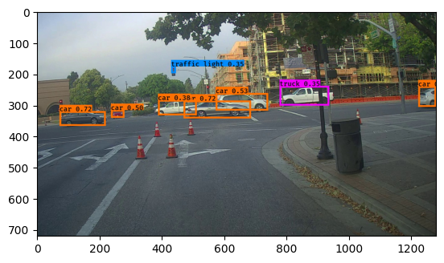
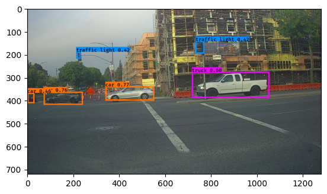
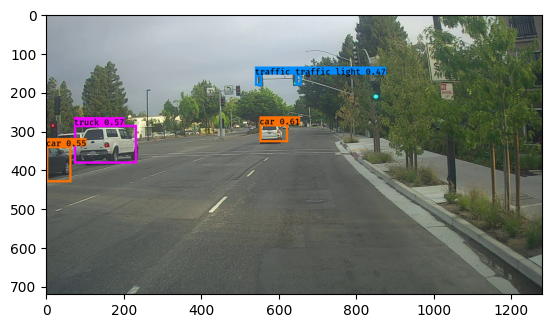
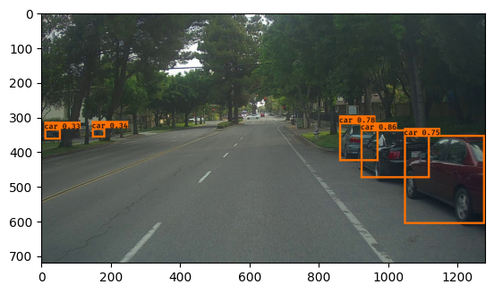
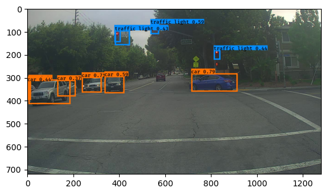

In this [experiment](G_Object_detection_exercise.ipynb), I used a pre-trained YOLO model to detect objects in an image, using the starting code, hints, object bounding box + label dataset and utility functions from the [Convolutional Neural Networks](https://coursera.org/learn/convolutional-neural-networks) course (by DeepLearning.AI on Coursera). The YOLO model is described in several papers, including [Redmon et al., 2016](https://arxiv.org/abs/1506.02640) and [Redmon and Farhadi, 2016](https://arxiv.org/abs/1612.08242). 

Following the Coursera assignment's instructions, I implemented the functions to apply **non-max suppression** on the bounding box outputs of the pre-trained YOLO model. That included discarding the output boxes with low probability score, and removing boxes that overlapped with each other and were just detecting the same object.

The model, when run on Coursera's dataset of images from a front camera of a car, can detect a variety of objects such as cars, trucks or traffic lights:

